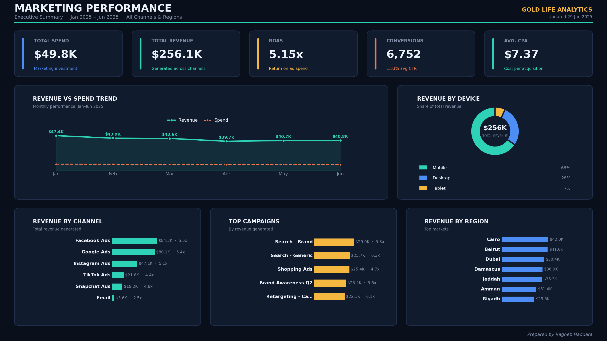
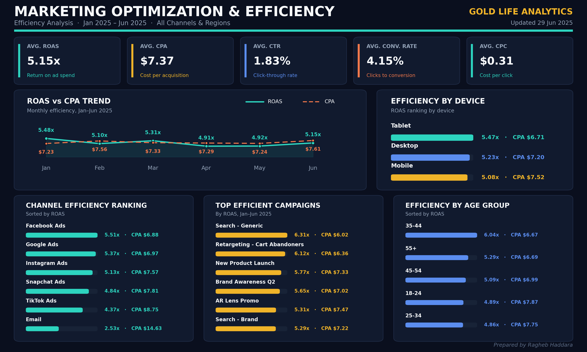
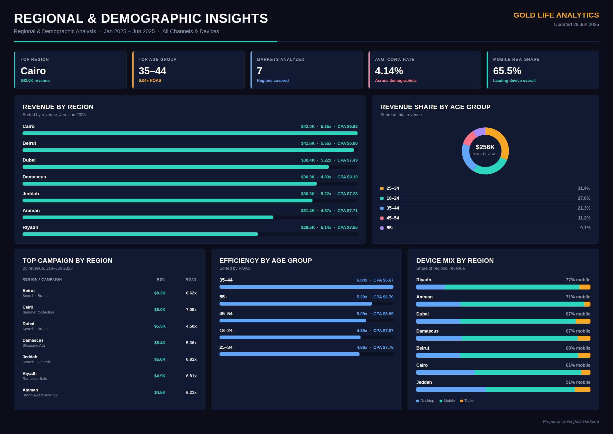
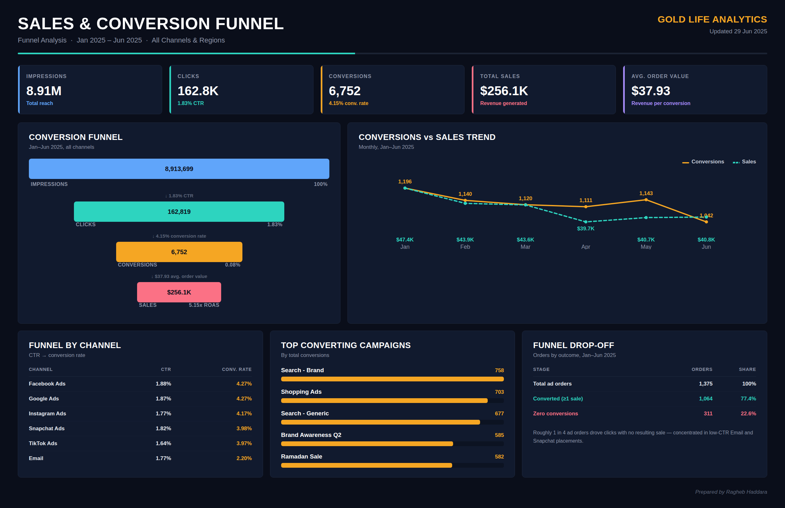

# 📊 E-Commerce & Multi-Channel Marketing Analytics Dashboard suit

A comprehensive, end-to-end multi-channel marketing performance analytics suite designed to evaluate advertising ROI, customer acquisition efficiency, campaign scalability, and regional demographics for e-commerce growth

---

## 📌 Executive Summary

This repository contains an end-to-end analysis of **$49.8K in marketing spend** generating **$256.1K in revenue** (**5.15x ROAS**) across 6 acquisition channels, 15 campaigns, and 7 MENA target regions. 

The project delivers a **4-Tier Dashboard Suite** tailored for cross-functional stakeholders—ranging from Executive C-Suite oversight to media buying execution and conversion funnel optimization.

### 🔑 Key Performance Indicators (Jan - Jun 2025)
* **Total Revenue Generated:** `$256,097.44`
* **Total Marketing Spend:** `$49,772.40`
* **Overall ROAS:** `5.15x`
* **Total Conversions:** `6,752`
* **Average CPA:** `$7.37`
* **Average CTR:** `1.83%`
* **Conversion Rate (CR):** `4.15%`
* **Average Order Value (AOV):** `$37.93`

---

## 🖥️ Dashboard Suite Breakdown

### 1️⃣ Dashboard 1: Executive Summary (`IMG_1872.png`)
Designed for C-level leadership, providing high-level visibility into total revenue, budget allocation, channel contribution, and revenue distribution across regions and devices.

* **Key Focus:** Revenue vs. Spend trends, Channel Revenue distribution, Top Revenue Markets.
* **Core Takeaway:** **Facebook Ads ($84.3K)** and **Google Ads ($80.1K)** drive over **64% of total revenue**, making them the primary revenue engines. Mobile devices dominate purchase share at **65.5%**.

---

### 2️⃣ Dashboard 2: Marketing Optimization & Efficiency (`IMG_1873.png`)
Built for Growth Marketers & Media Buyers to track unit economics, reduce ad waste, and optimize cost per acquisition (CPA) across ad networks and demographics.

* **Key Focus:** Monthly ROAS vs CPA stability, CPA rankings by platform and age group.
* **Core Takeaway:** **Age group 35–44** yields the highest efficiency with **6.04x ROAS** and the lowest CPA (**$6.67**). Email marketing shows critical inefficiency with a high CPA (**$14.63**), indicating a need for funnel restructuring.

---

### 3️⃣ Dashboard 3: Regional & Demographic Insights (`IMG_1874.png`)
Offers granular geographical and demographic breakdowns to guide localized ad targeting and localized marketing strategies.

* **Key Focus:** Regional revenue share, top converting campaign per city, device mix per region.
* **Core Takeaway:** **Cairo ($42.0K)** and **Beirut ($41.6K)** are the leading revenue hubs. **Riyadh** leads in mobile adoption (**77% mobile revenue share**), while **Jeddah** demonstrates higher desktop engagement (**39.8%**).

---

### 4️⃣ Dashboard 4: Sales & Conversion Funnel (`IMG_1875.png`)
Maps the full customer journey from ad impression down to completed transactions, pinpointing funnel drop-off rates and zero-conversion orders.

* **Key Focus:** Impression-to-Conversion drop-off, campaign conversion volume, order success rates.
* **Core Takeaway:** Out of 1,375 total campaign instances, **77.4% resulted in sales**, while **22.6% recorded zero conversions**, concentrated mostly in low-CTR Email and Snapchat placements.

---

## 📊 Dataset Structure (`marketing data.xlsx`)

The dataset comprises **1,375 transaction records** with the following schema:

| Column | Description | Type |
| :--- | :--- | :--- |
| `OrderID` | Unique transaction ID | Integer |
| `Date` | Transaction date (Jan - Jun 2025) | Datetime |
| `Channel` | Acquisition channel (Facebook, Google, TikTok, etc.) | String |
| `Campaign` | Campaign name | String |
| `Region` | MENA target city | String |
| `AgeGroup` | Target demographic age bracket | String |
| `Device` | Mobile, Desktop, Tablet | String |
| `Spend` | Ad spend amount ($) | Float |
| `Impressions` | Total impressions served | Integer |
| `Clicks` | Total ad clicks | Integer |
| `Conversions` | Completed purchases | Integer |
| `Revenue` | Revenue generated ($) | Float |
| `CTR / CR / CPA / ROAS` | Calculated performance metrics | Float |

---

## 💡 Strategic Recommendations

1. **Reallocate Budget to High-ROAS Demographics:** Scale budget allocation for the **35–44 age demographic** and **Search - Generic** campaigns which maintain **>6.0x ROAS**.
2. **Revamp Email & Snapchat Strategy:** Restructure Email automation flows to reduce the current **$14.63 CPA**, or reallocate underperforming spend to Search and Facebook Ads.
3. **Mobile-First Regional Optimization:** Optimize landing page speed and mobile checkout UI specifically for **Riyadh** and **Amman** where mobile share exceeds 70%.

---

## 🛠️ Tools & Technologies Used
* **Data Processing & Validation:** Python (Pandas), Excel
* **Visualization & UI/UX Design:** Dark-mode Analytics Suite
* **Version Control:** Git / GitHub

---
*Prepared by **Ragheb Haddara***

